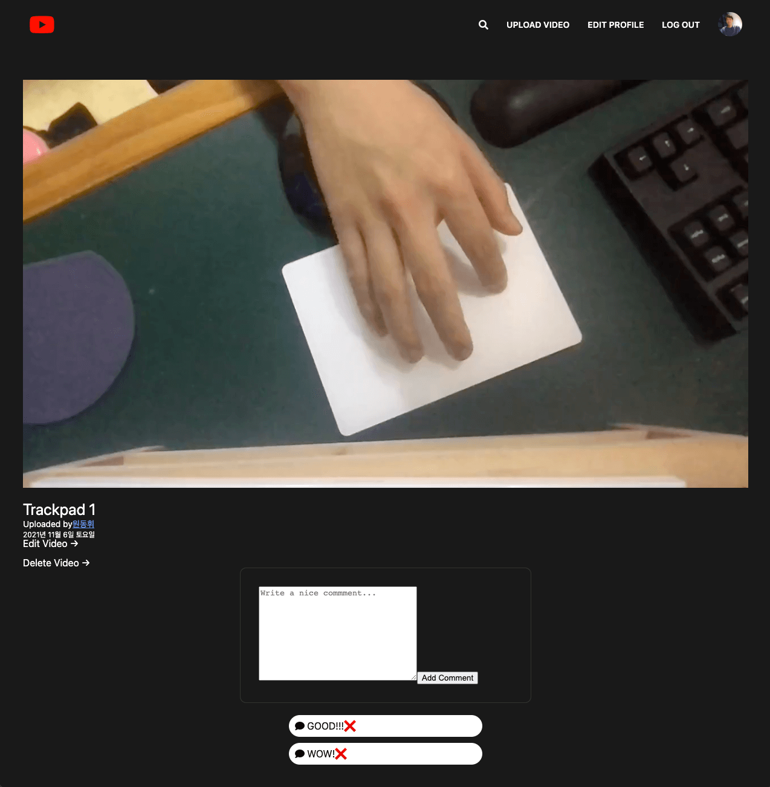

# pug, Node.js(express)를 이용한 wetube Project (FullStack)

> 나만의 유튜브 만들기 Project

- pug (template) / js / express / mongo DB

> 사용법

- yarn install
- yarn dev:assets   (Front 켜기)
- yarn dev:server   (Back 켜기)

아래를 클릭하면 프로젝트 동영상이 나옵니다.!

> back stack 

> Router 정책

- / -> Home
- /join -> Join
- /login -> Login
- /search -> Search

- /users/edit -> Edit user
- /users/delete -> Delete user

- /videos/watch -> Watch Video
- /videos/edit -> Edit Video
- /videos/delete -> Delete Video
- /videos/comments -> Comment on a video
- /videos/comments/delete -> Delete A Comment of a Video
